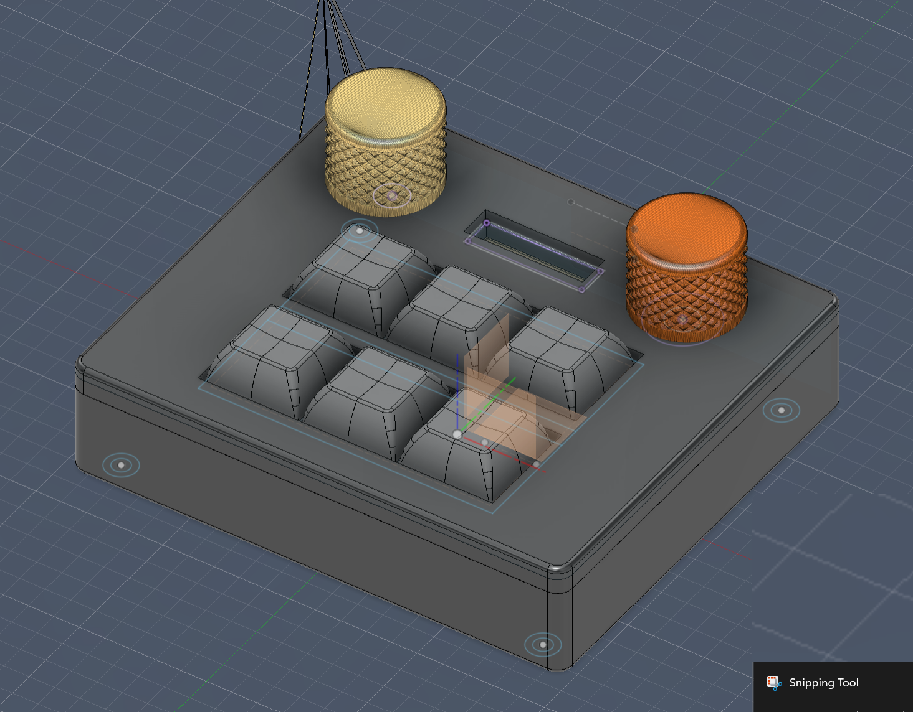
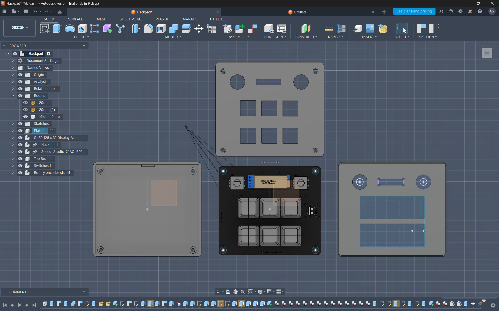
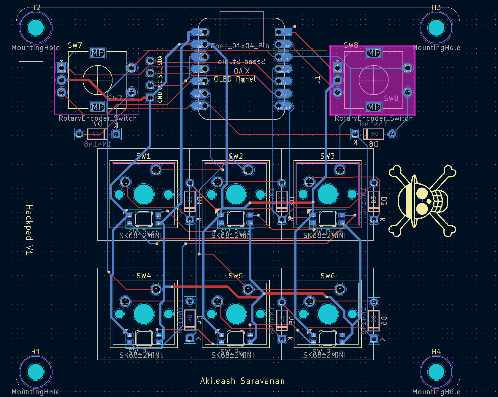
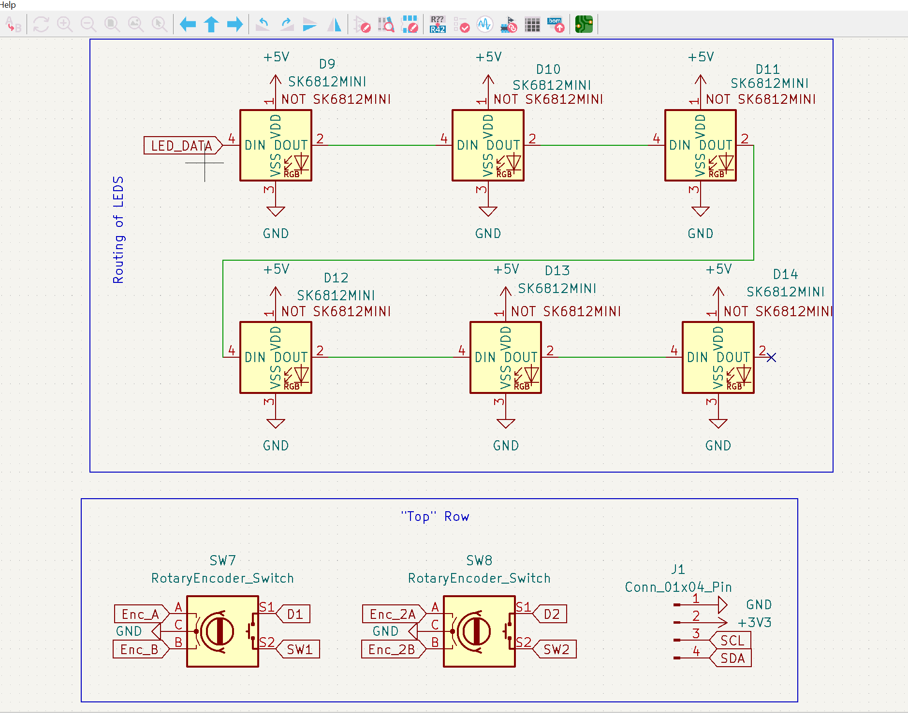
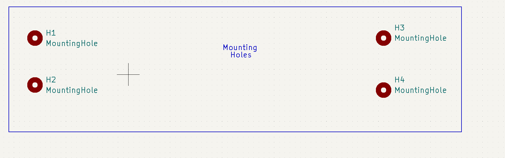
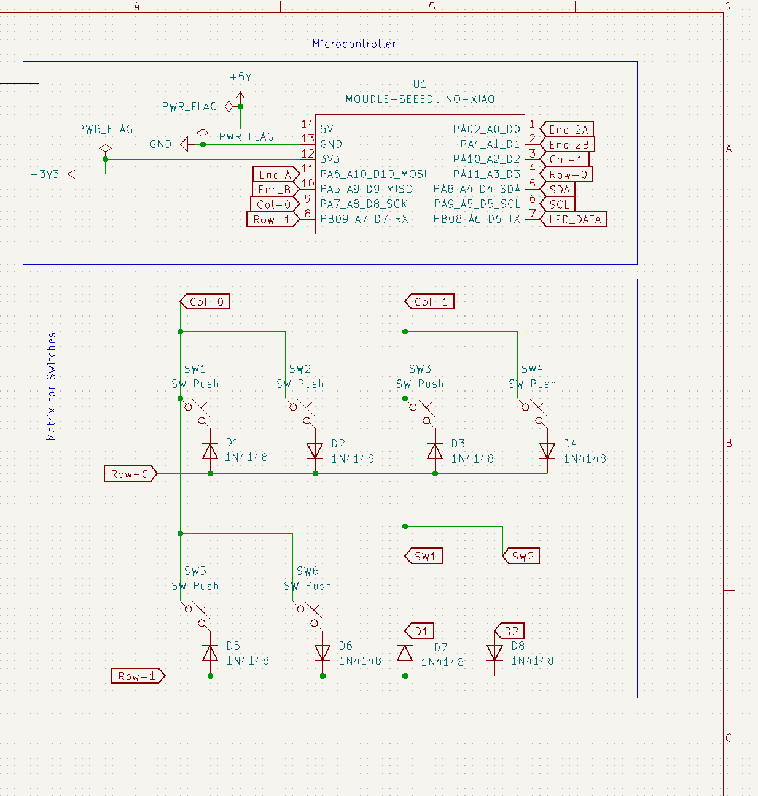

# HackPad V1

This is my custom macro pad project built around the Seeed Studio XIAO RP2040.  
It has a compact 6-key layout, two rotary encoders, a 0.91" OLED, and RGB lighting.

## Features

- 6 MX-style mechanical switches
- 2 EC11 rotary encoders
- 0.91" I2C OLED display (128x32)
- 6 SK6812 MINI-E RGB LEDs
- Custom 2-layer PCB designed in KiCad
- Custom case designed in CAD
- KMK-based firmware configuration

## Project Images

### Overall HackPad

### Parts

### PCB

### Schematics

## Bill of Materials (BOM)

| Item | Quantity | Description |
| :--- | :---: | :--- |
| MCU | 1 | Seeed Studio XIAO RP2040 (Unsoldered) |
| Switches | 6 | MX-Style Mechanical Switches |
| Keycaps | 6 | White Blank DSA Profile Keycaps |
| Encoders | 2 | EC11 Rotary Encoders |
| OLED Display | 1 | 0.91" I2C OLED (Pinout: GND-VCC-SCL-SDA) |
| Diodes | 8 | 1N4148 Through-hole Diodes |
| LEDs | 6 | SK6812 MINI-E RGB NeoPixels |
| Screws | 4 | M3x16mm Socket Head Cap Screws |
| Inserts | 4 | M3 Brass Heat-Set Inserts (5mm OD, 4mm Length) |
| PCB | 1 | Custom 2-Layer Hackpad PCB |
| Feet | 4 | Adhesive rubber bumpons (screw size may be 3x20 if needed) |

## Firmware

Firmware is in `Firmware/main.py`. Right now it is set up for:

- 6-key macro layout
- dual encoder input
- OLED output
- onboard RGB effects

## Repository Structure

- `Firmware/` - KMK firmware
- `PCB/` - KiCad files
- `CAD/` - complete CAD model
- `Production/Case/` - case production parts
- `Media/` - README images

## Notes

Images used in this README are stored in `Media/`:

- `MainPic.png`
- `Parts.png`
- `PCB.png`
- `Schematic1.png`
- `Schematic2.png`
- `Schematic3.png`
